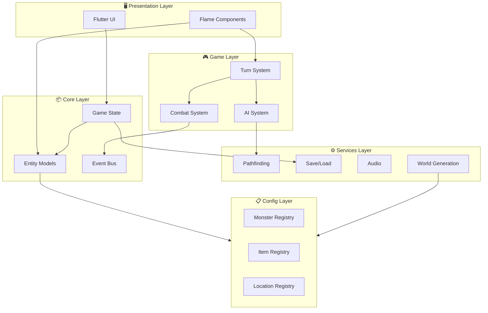
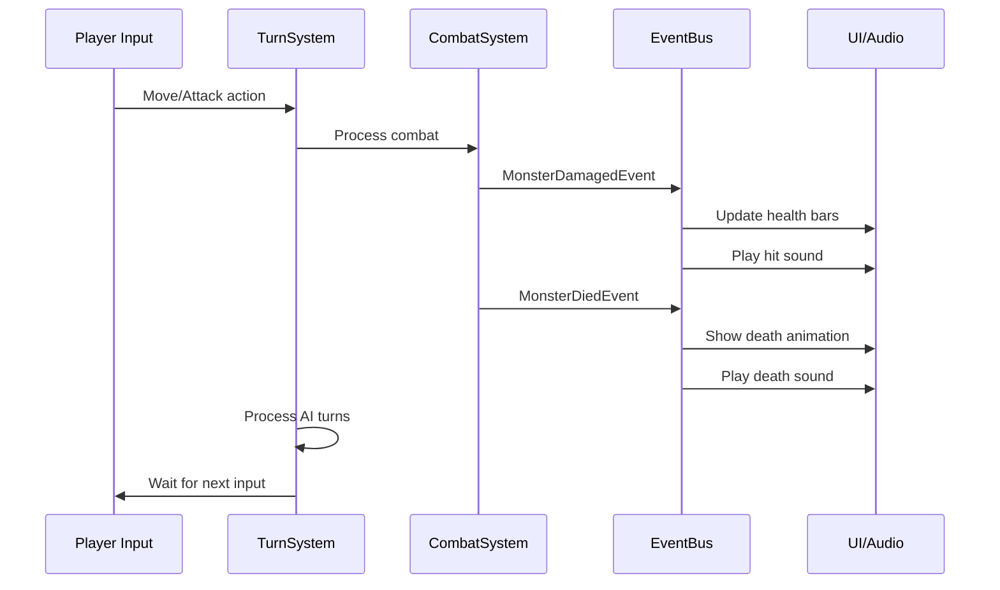

# Nyxis — Architecture Overview

A high-level overview of the game's architecture and component relationships.

---

## System Diagram



---

## Directory Structure

```
lib/
├── main.dart                 # App entry point
│
├── config/                   # 📋 Static game data
│   ├── constants.dart        # Game-wide constants
│   ├── monster_config.dart   # Monster definitions + registry
│   ├── item_config.dart      # Item definitions + registry
│   └── location_config.dart  # Location definitions + registry
│
├── models/                   # 📦 Data models
│   ├── entities/             # Player, Monster, Item
│   ├── world/                # Map, Tile, Location
│   └── game_state.dart       # Central game state
│
├── game/                     # 🎮 Flame game logic
│   ├── my_game.dart          # FlameGame subclass
│   ├── components/           # Visual components
│   │   ├── player_component.dart
│   │   ├── monster_component.dart
│   │   ├── item_component.dart
│   │   └── tile_component.dart
│   └── systems/              # Game logic systems
│       ├── turn_system.dart
│       ├── combat_system.dart
│       └── ai_system.dart
│
├── services/                 # ⚙️ Backend services
│   ├── pathfinding_service.dart
│   ├── save_service.dart
│   ├── audio_service.dart
│   └── dungeon_generator.dart
│
└── ui/                       # 🖥️ Flutter UI
    ├── screens/              # Full-screen views
    │   ├── main_menu_screen.dart
    │   ├── game_screen.dart
    │   └── inventory_screen.dart
    └── widgets/              # Reusable widgets
        ├── hud_widget.dart
        ├── health_bar.dart
        └── minimap_widget.dart
```

---

## Key Architectural Patterns

### 1. Registry Pattern

Centralized, type-safe access to game content definitions.

```dart
// Define once
MonsterRegistry.register(MonsterConfig(
  id: 'goblin',
  name: 'Goblin',
  health: 20,
  damage: 5,
));

// Use anywhere
final config = MonsterRegistry.get('goblin');
final monster = Monster.fromConfig(config);
```

**Benefits**: Single source of truth, easy balancing, serialization-friendly.

---

### 2. Event-Driven Communication

Systems communicate through events, not direct references.

```dart
// Fire events
eventBus.fire(PlayerMovedEvent(position));
eventBus.fire(MonsterDiedEvent(monster));

// Listen anywhere
eventBus.on<MonsterDiedEvent>().listen((e) {
  audioService.play('death.wav');
  uiService.showXpGain(e.monster.xpValue);
});
```

**Benefits**: Loose coupling, easy to add new reactions, testable.

---

### 3. Turn-Based Game Loop

```
Player Input → Process Player Turn → Process AI Turns → Update Render
      ↑                                                      │
      └──────────────────────────────────────────────────────┘
```

The `TurnSystem` orchestrates:
1. Wait for player action
2. Execute player action
3. Execute each monster action (via AISystem)
4. Update visual state

---

### 4. Per-Location Persistence

World data is saved per-location to avoid loading entire world into memory.

```
saves/
├── meta.json           # Save slot metadata
├── player.json         # Player state (global)
├── world_state.json    # Visited locations, flags
└── locations/
    ├── dungeon_1.json  # Only loaded when visited
    ├── dungeon_2.json
    └── town.json
```

---

## Data Flow



---

## Links

- [TECH_STACK.md](TECH_STACK.md) — Technology choices and packages
- [ROADMAP.md](ROADMAP.md) — Development phases and milestones
