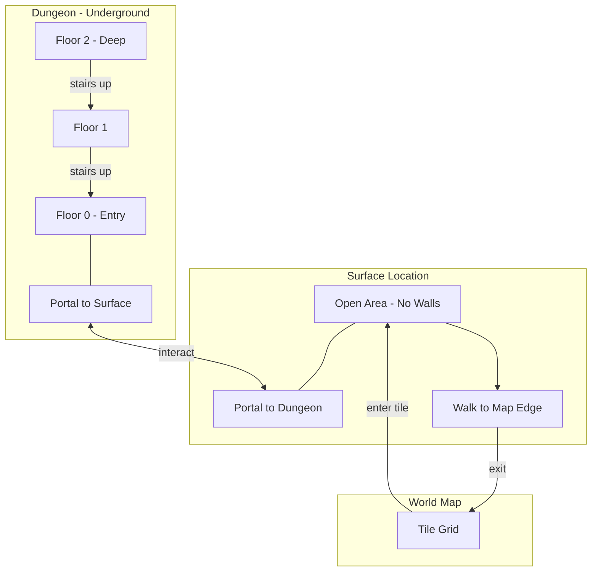

# Phase 7b: World Map Flow with Portals — Detailed Plan

> **Status**: Pending  
> **Goal**: Fix game flow to start in dungeon, use portal system for location connections, with surface locations as intermediate step to world map.

---

> [!IMPORTANT]
> Current behavior incorrectly starts on world map. Game should start in dungeon, use portal to reach surface, then discover world map by walking to surface edge.

---

## Overview

This phase addresses the fundamental game flow architecture and introduces the portal system for connecting locations. The player should begin their adventure in a dungeon, not on a world map. Portals connect dungeons to their surface locations, and surface locations connect to the world map via edge-based exit.

### Current vs Expected Flow

| Current Flow | Expected Flow |
|--------------|---------------|
| 1. Game starts on World Map | 1. Game starts in Dungeon (floor 0) |
| 2. Player selects location to enter | 2. Player explores dungeon, finds portal |
| 3. Player enters dungeon | 3. Portal leads to Surface location |
| 4. Stairs up exits back to world map | 4. Walking to Surface edge exits to World Map |

---

## Game Flow Architecture



---

## 7b.1 Game Initialization

### Start Game in Dungeon

**File: [lib/ui/screens/game_wrapper.dart](../../lib/ui/screens/game_wrapper.dart)**

Change initial state:

```dart
// Current
bool _isOnWorldMap = true;

// Target
bool _isOnWorldMap = false;
String? _currentLocationId = 'dark_dungeon';  // Start with default location
WorldMap? _worldMap;  // Lazy-initialized, null until first exit
```

Remove `WorldMapGenerator.generate()` from `initState()`.

### Change Floor Indexing

**File: [lib/game/my_game.dart](../../lib/game/my_game.dart)**

Change from 1-based to 0-based floor indexing:

| Location | Current | Target |
|----------|---------|--------|
| Line 109 (currentFloor getter) | `?? 1` | `?? 0` |
| Line 236 (_createGameState) | `floor: 1` | `floor: 0` |
| Line 275 (_createGameState) | `currentFloor: 1` | `currentFloor: 0` |
| Line 552 (_ascendFloor) | `prevFloor < 1` | `prevFloor < 0` |

### Update GameState Defaults

**File: [lib/models/game_state.dart](../../lib/models/game_state.dart)**

```dart
// Current
@Default(true) bool isOnWorldMap,

// Target
@Default(false) bool isOnWorldMap,

// Add world objects map
@Default({}) Map<String, WorldObject> worldObjects,
```

### Lazy World Map Generation

**File: [lib/ui/screens/game_wrapper.dart](../../lib/ui/screens/game_wrapper.dart)**

```dart
void _exitToWorldMap() {
  setState(() {
    // Generate world map on first exit
    _worldMap ??= WorldMapGenerator.generate();
    _isOnWorldMap = true;
    _currentLocationId = null;
  });
}
```

---

## 7b.2 Portal System

### PortalDefinition

**New file: [lib/config/portal_definition.dart](../../lib/config/portal_definition.dart)**

```dart
import 'package:freezed_annotation/freezed_annotation.dart';

part 'portal_definition.freezed.dart';

/// Defines a bidirectional portal connection between two locations
@freezed
class PortalDefinition with _$PortalDefinition {
  const factory PortalDefinition({
    /// Unique portal ID (e.g., 'dungeon_to_surface')
    required String id,
    
    /// First location config ID
    required String location1,
    
    /// Second location config ID
    required String location2,
    
    /// Display name when viewing from location1
    required String displayName1,
    
    /// Display name when viewing from location2
    required String displayName2,
    
    /// Floor in location1 where portal appears
    required int floor1,
    
    /// Floor in location2 where portal appears
    required int floor2,
  }) = _PortalDefinition;
}
```

### PortalRegistry

**New file: [lib/config/portal_registry.dart](../../lib/config/portal_registry.dart)**

```dart
import 'portal_definition.dart';

class PortalRegistry {
  static const List<PortalDefinition> portals = [
    // Dark Dungeon floor 0 <-> Dark Dungeon Surface
    PortalDefinition(
      id: 'dark_dungeon_to_surface',
      location1: 'dark_dungeon',
      location2: 'dark_dungeon_surface',
      displayName1: 'Exit to Surface',
      displayName2: 'Entrance to Dungeon',
      floor1: 0,
      floor2: 0,
    ),
    // Goblin Cave floor 0 <-> Goblin Cave Surface
    PortalDefinition(
      id: 'goblin_cave_to_surface',
      location1: 'goblin_cave',
      location2: 'goblin_cave_surface',
      displayName1: 'Exit to Surface',
      displayName2: 'Entrance to Cave',
      floor1: 0,
      floor2: 0,
    ),
  ];

  /// Get portal IDs that should be placed for a location on a specific floor
  static List<String> getPortalIdsForLocation(String locationId, int floor) {
    return portals
        .where((p) =>
            (p.location1 == locationId && p.floor1 == floor) ||
            (p.location2 == locationId && p.floor2 == floor))
        .map((p) => p.id)
        .toList();
  }

  /// Get portal definition by ID
  static PortalDefinition? getById(String id) {
    try {
      return portals.firstWhere((p) => p.id == id);
    } catch (_) {
      return null;
    }
  }

  /// Get destination info for a portal from a given location
  static ({String locationId, int floor, String displayName})? 
      getDestination(String portalId, String fromLocationId) {
    final def = getById(portalId);
    if (def == null) return null;
    
    if (def.location1 == fromLocationId) {
      return (locationId: def.location2, floor: def.floor2, displayName: def.displayName1);
    } else if (def.location2 == fromLocationId) {
      return (locationId: def.location1, floor: def.floor1, displayName: def.displayName2);
    }
    return null;
  }
}
```

### WorldObject Base Class

**New file: [lib/models/entities/world_object.dart](../../lib/models/entities/world_object.dart)**

```dart
import 'package:freezed_annotation/freezed_annotation.dart';
import '../world/position.dart';

part 'world_object.freezed.dart';
part 'world_object.g.dart';

/// Type of world object
enum WorldObjectType {
  portal,
  // Future: chest, lever, sign, shrine, etc.
}

/// Base class for interactive world objects that exist on tiles
@freezed
class WorldObject with _$WorldObject {
  const factory WorldObject({
    required String id,
    required WorldObjectType type,
    required Position position,
    required String configId,  // Reference to specific config (e.g., portalId)
    @Default(true) bool isInteractable,
  }) = _WorldObject;

  factory WorldObject.fromJson(Map<String, dynamic> json) => 
      _$WorldObjectFromJson(json);
}
```

### Portal Factory

**New file: [lib/models/entities/portal.dart](../../lib/models/entities/portal.dart)**

```dart
import 'world_object.dart';
import '../world/position.dart';

/// Factory methods for creating portal WorldObjects
class Portal {
  /// Create a portal world object
  static WorldObject create({
    required String portalId,
    required Position position,
  }) {
    return WorldObject(
      id: 'portal_${portalId}_${position.x}_${position.y}',
      type: WorldObjectType.portal,
      position: position,
      configId: portalId,
    );
  }

  /// Check if a world object is a portal
  static bool isPortal(WorldObject obj) => obj.type == WorldObjectType.portal;

  /// Get portal ID from a portal world object
  static String getPortalId(WorldObject obj) => obj.configId;
}
```

---

## 7b.3 Portal Placement

### Update Location Model

**File: [lib/models/world/location.dart](../../lib/models/world/location.dart)**

Add world object IDs:

```dart
/// IDs of world objects in this location (portals, chests, etc.)
@Default([]) List<String> worldObjectIds,
```

### PortalPlacement Utility

**New file: [lib/services/generation/portal_placement.dart](../../lib/services/generation/portal_placement.dart)**

```dart
import 'dart:math';
import '../../config/portal_registry.dart';
import '../../models/entities/portal.dart';
import '../../models/entities/world_object.dart';
import '../../models/world/location.dart';
import '../../models/world/position.dart';

class PortalPlacement {
  /// Find walkable positions for portals
  static List<Position> findPositions(Location location, int count, Random rng) {
    final positions = <Position>[];
    final map = location.map;
    
    int attempts = 0;
    const maxAttempts = 200;

    while (positions.length < count && attempts < maxAttempts) {
      final x = rng.nextInt(map.width);
      final y = rng.nextInt(map.height);
      final tile = map.getTile(x, y);

      if (tile.isWalkable && 
          !tile.isTransition &&  // Not on stairs
          !positions.any((p) => p.x == x && p.y == y)) {
        positions.add(Position(x: x, y: y));
      }
      attempts++;
    }

    return positions;
  }

  /// Create portal WorldObjects for a location/floor
  static List<WorldObject> createPortals(
    Location location,
    String locationConfigId,
    int floor,
    Random rng,
  ) {
    final portalIds = PortalRegistry.getPortalIdsForLocation(locationConfigId, floor);
    if (portalIds.isEmpty) return [];

    final positions = findPositions(location, portalIds.length, rng);
    final portals = <WorldObject>[];

    for (int i = 0; i < positions.length && i < portalIds.length; i++) {
      portals.add(Portal.create(
        portalId: portalIds[i],
        position: positions[i],
      ));
    }

    return portals;
  }
}
```

---

## 7b.4 Generator System

### GeneratorRegistry

**New file: [lib/services/generation/generator_registry.dart](../../lib/services/generation/generator_registry.dart)**

```dart
import 'location_generator.dart';
import 'dungeon_generator.dart';
import 'surface_generator.dart';

class GeneratorRegistry {
  static final Map<String, LocationGenerator> _generators = {};
  static bool _initialized = false;

  static void registerAll() {
    if (_initialized) return;
    register('dungeon', DungeonGenerator());
    register('surface', SurfaceGenerator());
    _initialized = true;
  }

  static void register(String type, LocationGenerator generator) {
    _generators[type] = generator;
  }

  static LocationGenerator get(String type) {
    return _generators[type] ?? _generators['dungeon']!;
  }
}
```

### SurfaceGenerator

**New file: [lib/services/generation/surface_generator.dart](../../lib/services/generation/surface_generator.dart)**

Creates open area with no walls - just floor tiles:

```dart
import 'dart:math';
import '../../config/location_config.dart';
import '../../models/world/location.dart';
import '../../models/world/map.dart';
import '../../models/world/tile.dart';
import 'location_generator.dart';

class SurfaceGenerator implements LocationGenerator {
  final int width;
  final int height;

  SurfaceGenerator({this.width = 30, this.height = 25});

  @override
  Location generate({
    required LocationConfig config,
    required int floor,
    required Random random,
  }) {
    // All floor tiles (no walls - surface is open)
    final tiles = List.generate(
      height,
      (y) => List.generate(width, (x) => Tile.floor()),
    );

    final gameMap = GameMap(width: width, height: height, tiles: tiles);

    return Location.create(
      configId: config.id,
      floor: floor,
      map: gameMap,
    );
  }
}
```

---

## 7b.5 Portal Interaction

### WorldObjectComponent

**New file: [lib/game/components/world_object_component.dart](../../lib/game/components/world_object_component.dart)**

Visual component for world objects (renders portal sprite on tile).

### Portal Traversal

**File: [lib/game/my_game.dart](../../lib/game/my_game.dart)**

Add method to handle portal interaction:

```dart
void _traversePortal(String portalId) {
  final currentLocationId = gameState.currentLocation?.configId ?? '';
  final destination = PortalRegistry.getDestination(portalId, currentLocationId);
  if (destination == null) return;

  // Save current floor state
  _saveCurrentFloorState();

  // Get or generate destination location
  final destLocation = _getOrGenerateFloor(destination.locationId, destination.floor);
  
  // Find portal exit position at destination (the same portal exists on both sides)
  final exitPortal = _findPortalInLocation(destLocation, portalId);
  final spawnPos = exitPortal?.position ?? 
      Position(x: destLocation.map.width ~/ 2, y: destLocation.map.height ~/ 2);
  
  _transitionToLocation(destLocation, destination.floor, spawnPos);
}

WorldObject? _findPortalInLocation(Location location, String portalId) {
  // Search world objects for matching portal
  for (final objId in location.worldObjectIds) {
    final obj = gameState.worldObjects[objId];
    if (obj != null && Portal.isPortal(obj) && Portal.getPortalId(obj) == portalId) {
      return obj;
    }
  }
  return null;
}
```

### Interaction Detection

When player steps on portal or presses interact key:

```dart
void _checkForPortalInteraction() {
  final playerPos = gameState.player.position;
  final portal = gameState.worldObjects.values.firstWhereOrNull(
    (obj) => Portal.isPortal(obj) && obj.position == playerPos,
  );
  
  if (portal != null) {
    _traversePortal(Portal.getPortalId(portal));
  }
}
```

---

## 7b.6 Edge-Based World Map Exit

**File: [lib/game/my_game.dart](../../lib/game/my_game.dart)**

In player movement handling, detect out-of-bounds on surface:

```dart
void _handlePlayerMovement(int dx, int dy) {
  final targetX = player.x + dx;
  final targetY = player.y + dy;
  final location = gameState.currentLocation;
  if (location == null) return;
  
  final config = LocationRegistry.get(location.configId);
  
  // Check if moving out of bounds
  final isOutOfBounds = targetX < 0 || targetX >= location.map.width ||
                        targetY < 0 || targetY >= location.map.height;
  
  if (isOutOfBounds) {
    // On surface location floor 0 -> exit to world map
    if (currentFloor == 0 && config.isSurface) {
      _exitDungeon();  // Calls onExitToWorldMap
      return;
    }
    // Block movement for other cases
    return;
  }
  
  // ... normal movement logic
}
```

---

## 7b.7 Location Config Updates

**File: [lib/config/location_config.dart](../../lib/config/location_config.dart)**

Add surface location configs:

```dart
LocationConfig(
  id: 'dark_dungeon_surface',
  name: 'Dark Forest',
  type: LocationType.surface,
  isSurface: true,
  maxDepth: 1,
  generatorType: 'surface',
  monsterPool: [],
  itemPool: [],
),

LocationConfig(
  id: 'goblin_cave_surface',
  name: 'Rocky Outcrops',
  type: LocationType.surface,
  isSurface: true,
  maxDepth: 1,
  generatorType: 'surface',
  monsterPool: [],
  itemPool: [],
),
```

---

## Files to Modify

| File | Changes |
|------|---------|
| `lib/ui/screens/game_wrapper.dart` | Start in dungeon, lazy world map |
| `lib/models/game_state.dart` | Add worldObjects map, change isOnWorldMap default |
| `lib/game/my_game.dart` | 0-based floors, use GeneratorRegistry, portal traversal, edge exit |
| `lib/models/world/location.dart` | Add worldObjectIds |
| `lib/config/location_config.dart` | Add surface location configs |

## Files to Create

| File | Purpose |
|------|---------|
| `lib/config/portal_definition.dart` | Portal connection config model |
| `lib/config/portal_registry.dart` | Static portal definitions |
| `lib/models/entities/world_object.dart` | Base class for world objects |
| `lib/models/entities/portal.dart` | Portal factory helpers |
| `lib/services/generation/portal_placement.dart` | Portal placement utility |
| `lib/services/generation/generator_registry.dart` | Generator factory |
| `lib/services/generation/surface_generator.dart` | Open area generator |
| `lib/game/components/world_object_component.dart` | Visual component |

---

## Testing Checklist

After implementation:

- [ ] Game launches directly into dungeon gameplay (no world map screen)
- [ ] Floor 0 is the starting floor
- [ ] Portal appears on dungeon floor 0
- [ ] Interacting with portal takes player to surface location
- [ ] Surface location is open (no internal walls)
- [ ] Portal back to dungeon exists on surface
- [ ] Walking to edge of surface location exits to world map
- [ ] World map is generated on first exit (lazy)
- [ ] Entering locations from world map works correctly
- [ ] Portals display correct names based on direction
- [ ] Save/load preserves portal and world object state

---

## Dependencies

This phase depends on:
- Phase 4 (World Generation) — ✅ Complete
- Phase 5 (Multi-Floor Dungeon) — ✅ Complete
- Phase 7 (World Map & Travel) — ✅ Complete

This phase is required for:
- Phase 8 (Release Pipeline) — proper game flow needed for release

---

## Deferred to Future Phases

- CaveGenerator with cellular automata layout
- TownGenerator for safe zones with buildings
- Additional WorldObject types (chests, levers, signs)
